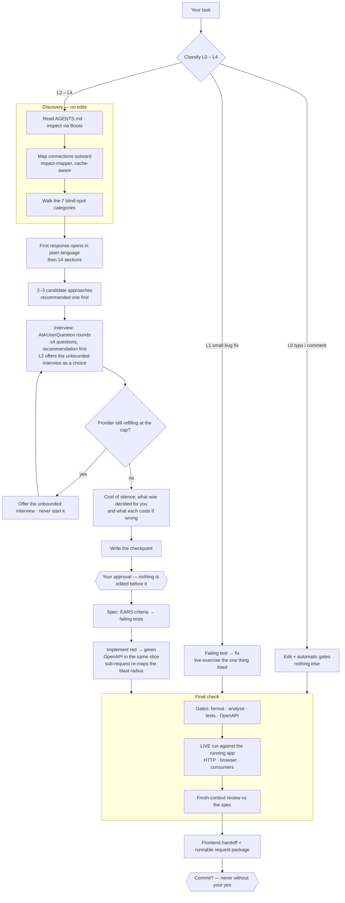

# Groundwork

A Claude Code plugin that makes an agent work a Laravel backend the way a senior engineer does:
find the blast radius before planning, agree on the plan before writing code, prove external-API
claims against cited docs instead of guessing, and refuse to call anything "done" until the gates —
format, static analysis, tests, OpenAPI — are green and the change has been exercised against the
running app.

The name is the method: *groundwork* is both the discovery and specification that come before the
first line of code, and the grounding protocol that makes the agent cite or verify a claim rather
than invent it.

One versioned source of process for every project, so repositories stay thin — domain facts in their
own `AGENTS.md`, nothing else copy-pasted between them.

Created and maintained by **Max Yastremskyi** ([YasMax91](https://github.com/YasMax91)). MIT.
Battle-tested day to day on production Laravel backends at RaDevs.

## In practice

Across **7 production codebases** as of August 2026: ~340 procedure runs, ~160 written specs, 27
auto-generated frontend hand-offs — and roughly **one task in three stopped before any code was
written**, because it was mis-scoped, conflicted with behaviour that already existed, or was
cheaper to solve without development at all.

That number is the point. An agent will happily write plausible code and just as happily report
that it is done; the cost is not the bad code, it is the code written against a task nobody
scoped. Groundwork makes the checking part of the process instead of an act of faith afterwards.

```
/plugin marketplace add YasMax91/groundwork
/plugin install groundwork@yasmax
/groundwork:init
```

Longer write-up, with the gates explained one by one:
**[yastremskyi.com/groundwork](https://yastremskyi.com/groundwork)**. Full install notes,
companion plugins and per-project configuration are further down this file.

## What's inside

- **Process (AI-SDD)** — skills: `start-task`, `spec`, `implement-approved`, `risk-review`,
  `final-check`, `estimate`, `init`. Discovery fans out via the `impact-mapper` agent (scaled by task level
  L0–L4) — the full blast radius before planning, so changes stay scoped without missing a consumer.
  Two review gates: `adversarial-verifier` (is the "it works" claim true?) and `conformance-reviewer`
  (does the diff satisfy the spec's acceptance criteria?). A converge re-check and ADR capture
  (`docs/adr/`) close out cross-cutting L3/L4 work.
- **Approaches before questions** — the first response shows the agent's 2–3 candidate ways to solve the
  task, recommended one first, with the reason and what it forecloses, *before* the interview — so you
  choose between shapes of a solution instead of ratifying one. When a single path is plainly right it
  says so in one line rather than inventing alternatives; at L3/L4 the same options feed the ADR. And when
  the intent is too unformed to plan at all — a problem rather than a change, no statable definition of
  "done", or an interview whose questions keep regenerating — the unbounded interview is not just offered
  but **recommended**, instead of planning on top of a guess. Accept it and the agent runs that interview
  **right there**, without you typing the command. `/grill` stays the manual way in for stress-testing
  something that is not a task yet.
- **Blast radius that follows the task** — a new sub-request mid-session is treated as a scope change: its
  seeds are compared against the cached impact map, and a miss re-maps over the union of old and new seeds
  (a targeted self-trace at L0/L1). The cheap comparison runs at every level, because three small
  additions can jointly touch a class nobody mapped — the case where a map built at task start quietly
  stops covering the work.
- **Interview loop** — `clarify-protocol` + `AskUserQuestion` rounds before the plan: facts are the
  agent's to find, decisions are yours to make. Each question leads with the agent's recommendation, so
  you can click through and still land somewhere defensible; scaled by level (L0/L1 barely ask, L2 up to
  two rounds, L3/L4 up to four), and every answer is recorded so a compaction never re-asks it. Money,
  permissions, what the client sees, and external-integration behaviour carry a round of their own from
  L2 up however settled the request sounds, and the first round always offers the unbounded interview as
  a choice — you pick the depth instead of learning later that you were not asked. Whatever the agent
  still decided for you is listed before the plan as the **cost of silence**: what was assumed, what it
  costs if wrong, and the one line that changes it. The `grill` skill runs the same interview standalone
  — to stress-test a plan, a decision, or an idea that never becomes code.
- **Plain language first** — every text where *you* decide (the discovery report, each interview
  question and option, the blind-spot block) opens with the lived consequence in everyday words and keeps
  the code, field name, or status number after it: "клиент нажимает «Оплатить» и видит ошибку, деньги не
  списываются (внутренний код 2406)". A layer, not a simplification — nothing technical is deleted, it
  just stops being the opening. Defined once in `clarify-protocol`; engineering summaries stay
  engineering prose.
- **Client document** — the `client-doc` skill writes for a client who does not know what a test or an
  endpoint is: the problem, what he will be able to do, what is in and out of scope, what is needed from
  him. Deliberately without tests, acceptance criteria, endpoints, schema, or architecture — if those are
  wanted, the artifact is a `spec`, and the skill says so instead of producing a hybrid. Estimates are
  **the real wall-clock time the agent spends building it** — never man-days, and never a man-day
  relabelled as hours: work on existing mechanisms is minutes and is published as minutes. Everything
  that needs a person — provider accounts, API keys, decisions, review — is a separate line with its own
  owner, never added to the development number. Ships as
  an English canonical file (what you send) plus a full Russian mirror (what you read), regenerated from
  the English so the two cannot drift.
- **Estimates are measured, not felt** — the `estimate` skill answers "how long will this take?" from a
  ledger of **this machine's own agent time**. `estimate-ledger.sh` records the active minutes of every
  finished task (idle gaps excluded, so a session you walked away from is not counted as work) — written
  by a `Stop` hook the moment the checkpoint is closed with `Mode: Done`, once per task, rather than by
  the agent remembering a command — and
  backfills a seed corpus from git history in seconds; an estimate quotes the median and the sample size
  it rests on. The unit is the agent's active minutes, human time is always a separate line with its
  owner, and an hour-sized number has to name the slow thing beside it — an external API to establish,
  a sandbox probe, a migration over a large table. A warn-only Stop gate (`gates.estimate_claim`)
  catches the ones that do not. Measured on this author's corpus, calendar span overstates active agent
  time by roughly 3×, which is why "how long did the last one take?" was never a safe substitute for
  measuring it.
- **Blind-spot surfacing** — the agent proactively raises what you did not think to ask: unintended
  consequences, missing requirements, and domain/product angles you are not the expert in — each with
  its consequence and a recommended default, in plain language. A `blind spots` block in the first
  response (distinct from clarify), the `blind-spot-mapper` agent in a fresh context for L3/L4, and
  touchpoints across spec, implementation, review, and frontend handoff. Calibrated against noise —
  material items only, "none" is honest. See `guidelines/blind-spot-protocol.md`. A blind spot that
  needs a product call is not left as a bullet — it becomes a question in the interview above.
- **Living domain contract** — the project's `AGENTS.md` (domain entities, invariants, permissions,
  integrations, and a domain-language glossary) is no longer written once by `init` and left to rot:
  `final-check` updates it in the same change whenever the work adds, renames, or removes one of those,
  so every later task reads a contract that still matches the code.
- **Live verification** — green gates are necessary, **not sufficient**: before "done", `final-check`
  exercises the change against the **running** app — a real HTTP run for an endpoint (the wire, the
  middleware, the real DB — not just the test kernel), and a real browser drive for admin/UI/CSS
  (the asset actually loads · the edited style is the *effective* computed one · no persisted
  `localStorage` state masking it). Coverage follows the impact map — every consumer of a touched shape
  (List *and* Show, export, API resource, notifications) with denormalized values checked on real data —
  and a defect **you** report gets its whole sibling class enumerated and reported — fixed inside the approved scope, offered as a named slice beyond it. Fail-safe: when the app
  or the browser tool is unreachable it says exactly what stayed unverified, with repro steps; green
  tests are never reported as "works live", and a visual check the agent can drive is never handed back
  to you.
- **Scaled to the task** — the full Definition of Done is the **L2+** one. An L0 typo gets the automatic gates and nothing else; an L1 bug fix gets the gates, a fail-first regression test, and a live exercise of the one thing fixed — not a sweep of every consumer. What scales down is breadth, never proof: "state what stayed unverified" and "never report green tests as works-live" hold at every level.
- **Frontend handoff** — after the final implementation and green gates, the `frontend-handoff` skill
  writes documentation for the frontend developer under `ai/frontend/` (a living reference doc per
  area + a dated handoff delta) — what to build, when, how, why, where, and the API contract, in
  Russian, no frontend code — plus a **runnable request package** (a Postman collection or a `.http`/curl
  file) with the auth header, bodies derived from the `FormRequest` rules, and real example responses
  captured in the live run, so the frontend runs the contract instead of retyping it. Then asks whether
  to commit (single line, no AI attribution).
- **OpenAPI as contract** — `openapi-protocol` + a blocking `openapi` Stop gate: an endpoint change
  that ships without its annotations is not "done". Every operation is complete to the last detail —
  every reachable status code (success + 401/403/404/409/422), the request body derived from the
  FormRequest rules, the response schema derived from the JsonResource, enums from the real PHP enums —
  and generation must be clean. **Two toolchains, judged differently**: annotation-driven
  (`l5-swagger` / `swagger-php`) proves the contract moved when an annotation changed; inference-driven
  (`dedoc/scramble`) has no annotations to look for, so the evidence is the exported document at
  `openapi.spec_path` changing — and the block message names the export, never annotations the project
  cannot have. `openapi.generator` (`annotation` | `inference`) overrides the detection. The gate is
  fail-safe (silent without OpenAPI tooling) with a visible escape hatch (`OpenAPI: n/a — <reason>` in
  the checkpoint). `final-check` additionally proves the document is *usable* — `openapi-typescript`
  must consume it, since an unresolvable `$ref` generates cleanly and breaks every client generator.
  The `openapi-audit` skill repairs pre-existing spec debt across a whole project.
- **The frontend gets the contract, not a description of it** — `frontend-handoff` copies the generated
  document to `ai/frontend/openapi/<date>-<slug>.yaml` and commits it, so the frontend generates types
  from the contract and can serve it as a mock (`npx @stoplight/prism-cli mock <snapshot>`) before the
  backend is deployed.
- **What a finished task leaves behind** — at L2+ `final-check` writes `docs/specs/<slug>.receipt.md`
  next to the spec, in three blocks that cannot be confused: **Measured** (commit SHA, the analyse and
  suite exit codes, OpenAPI generation status, the ledger's active minutes — each copied from a
  command's output, and a gate that did not run written as *not run*), **Claimed by the agent** (the
  AC → status → `file:line` → covering-test table and the conformance verdict — a suite's aggregate exit
  code cannot say which test closed which criterion), and **Reviewed by**, left empty for a person. The
  file states in its own last line that an unsigned receipt is not a review. The same AC table goes into
  the PR body.
- **TDD** — `tdd-protocol`: test-first (red→green→refactor) for L2+ features and bug fixes; the test
  suite is a Stop gate. The layered split matches the standards — feature tests for the contract,
  unit tests for services/calculations/state transitions. Acceptance criteria are EARS statements with
  stable IDs, each linked to its fail-first test.
- **Grounding** — `grounding-protocol` + the `ground-integration` skill + the `grounded-researcher`
  and `adversarial-verifier` agents. Read reality, never guess: executable proof covers internal feature
  endpoints as well as external sandboxes, and a claim resting on official docs or an internal project
  doc (`AGENTS.md` / CRD) is cited — source + quote — **in the answer itself**, or marked `UNKNOWN`.
- **Deep skills (L3/L4, opt-in)** — `deep-grounding` · `deep-discovery` · `deep-review`: Workflow-driven
  multi-agent escalations of grounding / discovery / review, each finding adversarially verified.
  ~15× tokens, gated to explicit invocation; graceful fallback to the single-agent skill when the
  `Workflow` tool is unavailable. As of v0.26.0 the orchestration ships as **executable workflow
  scripts** in `workflows/`, not as reference text the model retypes each run — so the fan-out, the
  adversarial panel and the dedup are identical every time, and a stopped run resumes from its cached
  agent results instead of starting over. The skills stay the entry points (level gating, cost
  disclosure, seed collection) and call the scripts with `args`; each script is also runnable directly
  as `/groundwork:deep-review-run`, `/groundwork:deep-discovery-run`, `/groundwork:deep-grounding-run`
  when you want the orchestration without the gating. Every script returns its own counts — findings
  examined vs confirmed, seeds mapped vs failed, edges found vs verified — so the report carries a
  denominator instead of an unquantified list.
- **The standards say what is enforced and what is not** — `laravel-standards` opens with the six rules
  a hook actually holds (each row naming the hook file and its opt-out) and states plainly that the rest
  of the page — thin controllers, logic in services, transactions, guarded transitions, money as
  decimal, ULIDs at the edge — is an instruction nothing checks automatically, caught if at all by
  `conformance-reviewer` and `risk-review`. It also carries the framework baseline: versions come from
  `composer.lock`, and a project past its bug-fix window (Laravel 12 since 2026-08-13) hears about it
  once per session from the `SessionStart` hook.
- **Standards + gates** — `laravel-standards` + hooks: Pint on edit, static analysis and the test
  suite as done-gates, and a `PreToolUse` enforcement guard that denies host Laravel/PHP commands
  (use the runner) and edits to shipped migrations — opt-out per project. Every gate honors the declared
  `runner`: a `runner: host` project runs host commands and is never denied them, and a command that
  cannot run at all (missing binary, undefined script) is reported as an environment problem rather than a
  red. All hooks are covered by tests — `bash hooks/tests/all.sh` (313 cases, 15 suites), run on every push by `.github/workflows/ci.yml`.
- **A gate that did not run says so** — the hooks' skip paths (runner unavailable, test DB busy, generator
  unreachable) exit with a *visible* non-blocking notice instead of a silent success, because a message on
  a zero exit goes to the debug log and reaches nobody. And committing no longer disarms them: the gates
  read the working tree **plus unpushed commits** (`gates.check_unpushed`), so the last Stop of a task —
  the one right after the commit, where "done" is announced — still verifies the work.
- **Parallel-session safety** — two sessions in one checkout share the test database, and the falsely-red
  gates that follow (`1412 Table definition has changed` → `1146 doesn't exist`) cost real debugging time.
  The test gate takes an exclusive lock around the suite so parallel runs queue; if it cannot be had in
  `gates.test_lock_wait_seconds` (default 45) it **skips and says so** rather than reporting a red that
  belongs to nobody. Opt out with `gates.test_db_lock: false`. The complementary practice the plugin
  cannot enforce — one git worktree per parallel session — is documented in `working-memory`.
- **No prompt for its own bookkeeping** — the checkpoint and the impact cache under
  `.claude/groundwork/` are auto-approved by the plugin's `PreToolUse` hook, narrowly and only for that
  path. A settings rule cannot do this: `Write(path)` rules are accepted but never matched, and a
  first-time checkpoint is created by `Write`, not `Edit`. Your own `deny` / `ask` rules still win
  over it.
- **Working memory** — `working-memory` guideline + a `SessionStart` hook that cheaply re-injects
  project state (runner, DB engine, branch, uncommitted files, active spec, the task checkpoint) so
  the agent does not re-read the same files, and a `PreCompact` hook that marks the checkpoint as the
  source of truth before the transcript is thinned. The workflow skills keep a terse task checkpoint
  and a cached `impact-mapper` blast-radius map under `.claude/groundwork/` — context stays light, but
  nothing is forgotten across stops, restarts, or compaction.
- **Status / UI** — a persistent status line (`branch · engine · mode · level · spec`, opt-in via
  `init` + `ui.statusline`), in-action hook messages (`Groundwork: running tests…`), and a session banner +
  title. All fail-safe — unsupported display fields degrade to a no-op.
- **Templates** — thin project `AGENTS.md` / `CLAUDE.md` / `.groundwork.json` and six spec templates.

## How it works — the pipeline



Levels scale *breadth*, never *proof*: at every level the agent states what stayed unverified and never
reports green tests as "works live".

**Discovery** reads the project's `AGENTS.md`, inspects through Boost rather than memory, and maps the
connections grep alone misses — events, observers, jobs, policies, FK cascades, the `JsonResource` shape
and its consumers. The blast-radius cache is reused only when three conditions hold, the third being that
it still covers the seeds of the work at hand.

**Before asking, the agent takes a position:** two or three candidate approaches with the recommended one
first — and if the intent is too unformed to plan at all, it recommends the unbounded interview rather
than planning on a guess. Questions then arrive as buttons, each led by a recommendation, in plain
language.

**Nothing is edited before your approval**, and the decisions you make are written to a checkpoint that
survives a restart or a compaction.

**"Done" requires the running app, not just green tests** — a real HTTP call for an endpoint, a real
browser for admin/UI (asset actually loads · effective computed style · no persisted state masking it).
On L2+ every consumer of a touched shape is verified and a reported defect gets its whole sibling class
enumerated. When something could not be verified, that is stated rather than glossed over.

**The gates are honest about themselves:** a skip (runner unavailable, test DB busy, generator
unreachable) is a *visible* notice, not a silent success, and committing does not disarm them — they read
the working tree plus unpushed commits.


## Grounding split

- **Boost → the framework**: version-aware Laravel docs, DB schema, models, logs (a per-project
  `laravel/boost` composer dependency).
- **Context7 → the packages Boost does not index** (a Spatie/Filament version, a provider SDK):
  library docs, cited like any other source. Optional — part of the companion bundle below.
- **This plugin's protocol → external APIs** (payments, booking, messaging): capability matrix +
  cited source + sandbox proof. This is the part Boost does not cover.

## Install (in a project)

```
/plugin marketplace add YasMax91/groundwork
/plugin install groundwork@yasmax
/groundwork:init
```

`init` generates thin, domain-only contracts by grounded discovery (deriving facts from the code,
Boost, and docs, labelling anything assumed), installs Boost, and drops `.groundwork.json`.

## Companion plugins — `groundwork-pack`

A second, component-free plugin in this marketplace: its manifest is nothing but a `dependencies`
list, so one install pulls this plugin plus the external plugins the pipeline leans on. The workflow
plugin stays self-contained — install `groundwork` on its own and nothing external is
required.

```
/plugin marketplace add anthropics/claude-plugins-official
/plugin install groundwork-pack@yasmax
```

A plugin enters on two conditions: a **named step** reaches for it, and it costs close to nothing when
that step is not running.

| Plugin | The step that uses it | Standing cost |
| --- | --- | --- |
| `php-lsp` (Intelephense) | `start-task` step 3 — symbol lookup goes through the `LSP` tool before grep, which follows imports, aliases and inheritance a name match misses. Main-session only: a background subagent has no `LSP` tool, so `impact-mapper` stays on grep + Boost. | none — an LSP config, no context |
| `context7` | `grounding-protocol` — the source between Boost and the open web, for packages Boost does not index (a Spatie/Filament version, a provider SDK). `grounded-researcher` follows the same order. | 2 deferred MCP tools |
| `playwright` | `final-check` live verification — the browser drive for admin/UI/CSS work, so the step does not depend on `claude-in-chrome` being present for whoever runs it. | deferred MCP tools |
| `sentry` | `start-task` step 3 — a production bug starts at the real issue (stack trace, release, frequency), not at a repro reconstructed from the report. | deferred MCP tools + router skills |

Every step is conditional on the tool being present and has to say so when it is not — an unrun scan
is reported, never passed off as a clean one, and the check it would have done falls back to reasoning
by hand rather than disappearing. Nothing in the gates depends on the bundle: `format`, `analyse`,
`test` and `openapi` are shell commands through the runner and behave identically without it.

### Deliberately not bundled

Two tools have a step in the pipeline but stay opt-in, because their cost is paid on every turn
whether or not the step runs:

- **`semgrep`** — the `risk-review` scan calls the **CLI** (`semgrep --config auto <changed files>`),
  which runs locally and needs no account. The marketplace *plugin* is the thing to avoid by default:
  it installs a hook that scans on every file write and its setup expects a Semgrep cloud login, so a
  scan meant for one review step becomes output on every edit.
- **`42crunch`** — a real OWASP-API audit of the OpenAPI document, but it ships five model-invoked
  skills whose descriptions sit in context permanently, and it needs a 42Crunch account. Worth
  installing for a project with a public API and a subscription; not worth it for everyone else, where
  `openapi-protocol` step 4 walks the same questions by hand.

### What the bundle costs

MCP tool definitions are deferred: with [tool search](https://code.claude.com/docs/en/mcp) on (the
default), only tool *names* and server instructions load at session start, so three MCP servers add
roughly a thousand tokens, not the tens of thousands their full schemas would. That is the whole
reason the set favours MCP- and LSP-only plugins over skill-heavy ones. Turn a server off in `/mcp`
for a session that will not touch it, and check `ENABLE_TOOL_SEARCH` before adding anything larger —
with tool search disabled, every schema loads upfront.

**Subagents reach MCP by server name.** A subagent's `tools` list is an allowlist that drops every MCP
server it does not name, so the agents grant themselves exactly what their job needs — `impact-mapper`
gets `mcp__laravel-boost` and nothing else; `grounded-researcher` and `adversarial-verifier` also get
`mcp__context7`. Two consequences worth knowing: a Boost server registered under a different name is
invisible to them (`init` fixes the name for this reason), and the `LSP` tool is main-session only, so
symbol-level navigation belongs to `start-task`, never to the mapper.

Both marketplaces have to be configured: a dependency whose marketplace is missing stays unresolved
and disables the bundle. Cross-marketplace resolution is opt-in — `allowCrossMarketplaceDependenciesOn`
in `marketplace.json` names the one marketplace this bundle may pull from. `claude plugin prune`
removes the auto-installed dependencies if the bundle is uninstalled.

The dependencies bring their own runtime requirements, none of which this plugin manages: `php-lsp`
needs `npm i -g intelephense`; `context7` and `playwright` run through `npx` on Node 18+ (a Context7
API key is optional, for higher rate limits); `sentry` authenticates against the org that already
receives the project's errors. The optional pair needs `semgrep` on `PATH` (Homebrew or pipx) and a
42Crunch account respectively.

## Update everywhere

```
/plugin marketplace update
```

Versioned with semver in `.claude-plugin/plugin.json` — projects update when you bump it.

## Develop locally

```
claude --plugin-dir /path/to/groundwork
```

Then `/reload-plugins` after changes. Test skills with `/groundwork:<skill>`, check the
agents in `/agents`, and confirm the hooks fire on edits.

## Per-project configuration — `.groundwork.json`

Declares the runner and the **database engine** (`database.default` — `mysql`/`pgsql`, the target for
code and tests; never SQLite). Gate commands are derived from `runner` and only need `commands.*` when a
project genuinely runs them differently — the shipped template leaves `commands` empty for that reason,
since a pinned command would override the runner. It can still override the gate commands (`format`,
`analyse`, `test`) and
toggles (`format_on_edit`, `analyse_on_stop`, `test_on_stop`, `openapi_on_stop`, plus the `PreToolUse` enforcement
toggles `enforce_runner` and `lock_shipped_migrations` — default **on** — and `lock_edits_in_discovery`
— default **off**). `runner` is honored by every gate: set `"runner": "host"` and the gates drop the Sail
prefix (`php artisan …`, `./vendor/bin/pint`) and stop denying host commands. `test_db_lock` (default
**on**) and `test_lock_wait_seconds` (default 45) serialise the suite across parallel sessions. A `memory` block toggles the working-memory layer (`session_context`,
`checkpoint`, `impact_cache` — all default on). Defaults to Sail + MySQL.

The plan-approval gate is the `start-task` → approval → `implement-approved` split; enable
`lock_edits_in_discovery` (or Claude Code's native `defaultMode: "plan"`) for a hard
read-only-while-planning gate.

`gates.openapi_on_stop` (default **on**) blocks "done" when the API contract surface changed but the
OpenAPI spec did not, then regenerates the document and blocks again if generation errors or warns.
It no-ops silently unless the project has `darkaonline/l5-swagger` or `zircote/swagger-php`; override
the generate command with `commands.openapi_generate`, the watched paths with `openapi.surface[]`
(defaults to `routes/`, `app/Http/Controllers/`, `app/Http/Requests/`, `app/Http/Resources/`), and
force it on for a project with a hand-maintained document via `openapi.enabled: true`.

`gates.task_intent` (default **on**) and `gates.agent_contract` (default **on**) are the two engine-level
enforcements added in v0.27.0, each replacing a rule that existed only as a sentence in a prompt.

The first is a `UserPromptSubmit` hook. v0.23.0 put "a task described in chat enters through
`start-task`, no command needed" into the session-start context — but session start happens once, and by
the tenth task stated in a long session that line is far behind in context. The hook says it again at the
moment a task is actually stated: it fires on a prose task statement while the checkpoint has no mode,
adds context, and **never blocks**. It stays quiet on questions, on short replies, on explicit slash
commands, and once a mode is set — and it fires at most once per session while the mode is still unset,
because a reminder that repeats every prompt only teaches the reader to skip it. The mode appearing
resets it for the next task.

The second is a `SubagentStop` hook on `grounded-researcher` and `adversarial-verifier`. The grounding
protocol's central rule — never guess; every claim carries a source or is marked `UNKNOWN` — was enforced
only by the agents' own prompts. Now a research report with no URL, no repository document, no
`file:line` and no `UNKNOWN` is sent back once to add its evidence, and a verification that ends without
`CONFIRMED` / `REFUTED` / `UNCERTAIN` is sent back once for its verdict. Both were verified against a live
subagent on Claude Code 2.1.212 before the design was written: the block does send the agent back, and it
returned with its sources added.

`gates.analyse_on_stop` (default **on**) blocks "done" when static analysis fails on changed PHP — and
as of v0.25.0 it can no longer be satisfied by a placeholder. `echo '…'`, `true` and `:` all exit 0, so
a project that wrote one into `commands.analyse` to quiet the gate was being told its analysis ran
clean; the gate now refuses a no-op command and says nothing was analysed. Turning the gate off stays a
legitimate decision, but it is recorded as one: set `gates.analyse_on_stop: false` together with
`gates.analyse_skip_reason`, or every Stop with changed PHP reports that the code went unanalysed. The
`init` skill offers Larastan with a generated baseline so an existing codebase is judged on new code.

`gates.coverage_claim` (default **on**) watches what the agent *said* rather than what the repository
holds. "I checked it selectively" satisfies the Definition of Done's "state what stayed unverified"
literally while hiding whether that was eight of nine or one of nine, so a verification claim now takes
one of three forms — a covered/total fraction against a named enumerable set, that fraction plus the
listed gap, or a plain "no verification was performed" — and a fraction is never estimated. The Stop
hook reads `last_assistant_message` for hedges in Russian and English and **warns without blocking**,
logging every trigger to `.claude/groundwork/coverage-claims.log`; a regex over natural language will
have false positives, and that log is the evidence that decides whether a later version blocks. It
makes no model call, stays silent when the claim already carries its denominator, and returns nothing
when `stop_hook_active` is set. The smooth form of the same failure — a confident claim with no hedge
and no count — is caught by `adversarial-verifier` and `conformance-reviewer` instead.

**And a silent decision does not stay silent.** The cost-of-silence list that `start-task` prints
before the plan now has a second half in `final-check`: every decision the agent took without asking
*since* the plan was approved, with the alternative it did not take and what changes if it was wrong.
An item earns its line only when the agent decided it alone and it moves observable behaviour, money,
permissions, or a contract. The blind-spot taxonomy gained the matching category — unconfirmed
assumptions about the business domain, a provider's terms, a financial or legal consequence, and what
the client will do with the result — which is what "I did not realise it worked that way" looks like
before it becomes a production incident.

`gates.trim_tool_output` (default **off**) enables a fail-safe `PostToolUse` trimmer that collapses
passing-test / clean-analysis spam from noisy commands to save context. It never trims when any
failure indicator is present and does nothing if it cannot positively locate the tool output, so a
wrong guess degrades to a no-op. The PostToolUse output field is not fully documented — confirm it
once with `claude --debug` in your project before enabling.

## Layout

```
.claude-plugin/   plugin.json · marketplace.json
pack/             groundwork-pack — dependency-only bundle (this plugin + companion plugins)
skills/           start-task · spec · implement-approved · risk-review · final-check · estimate · ground-integration · frontend-handoff · client-doc · openapi-audit · grill · init · deep-grounding · deep-discovery · deep-review
agents/           impact-mapper · blind-spot-mapper · grounded-researcher · adversarial-verifier · conformance-reviewer
hooks/            hooks.json · lib.sh (shared resolvers) · session-start.sh · pre-compact.sh · task-intent.sh · format-on-edit.sh · done-gate.sh · test-gate.sh · openapi-gate.sh · coverage-claim.sh · estimate-claim.sh · estimate-ledger.sh · agent-contract.sh · trim-output.sh · pre-tool-guard.sh · statusline.sh · tests/all.sh
workflows/        deep-review-run.js · deep-discovery-run.js · deep-grounding-run.js — the multi-agent orchestration, executed by the runtime
guidelines/       ai-sdd-process · grounding-protocol · blind-spot-protocol · clarify-protocol · openapi-protocol · laravel-standards · tdd-protocol · writing-standards · working-memory
docs/             skill-hygiene (author-facing) · specs/
templates/        project/ · specs/ · frontend/ (feature · handoff — both pointing at the runnable request package) · client-doc.md · adr.md
```
