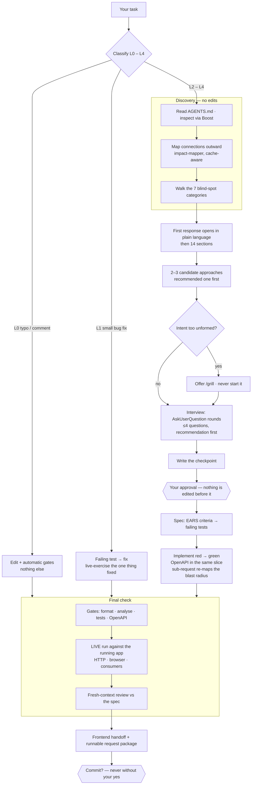

# groundwork

Claude Code plugin for Laravel backends — created and maintained by **Max Yastremskyi** (YasMax91).
One central, versioned source for how the RaDevs team works, so projects stay thin and consistent
instead of copy-pasting `AGENTS.md` / `CLAUDE.md` / skills between repositories.

## What's inside

- **Process (AI-SDD)** — skills: `start-task`, `spec`, `implement-approved`, `risk-review`,
  `final-check`, `init`. Discovery fans out via the `impact-mapper` agent (scaled by task level
  L0–L4) — the full blast radius before planning, so changes stay scoped without missing a consumer.
  Two review gates: `adversarial-verifier` (is the "it works" claim true?) and `conformance-reviewer`
  (does the diff satisfy the spec's acceptance criteria?). A converge re-check and ADR capture
  (`docs/adr/`) close out cross-cutting L3/L4 work.
- **Approaches before questions** — the first response shows the agent's 2–3 candidate ways to solve the
  task, recommended one first, with the reason and what it forecloses, *before* the interview — so you
  choose between shapes of a solution instead of ratifying one. When a single path is plainly right it
  says so in one line rather than inventing alternatives; at L3/L4 the same options feed the ADR. And when
  the intent is too unformed to plan at all — a problem rather than a change, no statable definition of
  "done", or an interview whose questions keep regenerating — it offers the `grill` skill instead of
  planning on top of a guess — and if you accept, it runs that unbounded interview **right there**,
  without you typing the command. `/grill` stays the manual way in for stress-testing something that is
  not a task yet.
- **Blast radius that follows the task** — a new sub-request mid-session is treated as a scope change: its
  seeds are compared against the cached impact map, and a miss re-maps over the union of old and new seeds
  (a targeted self-trace at L0/L1). The cheap comparison runs at every level, because three small
  additions can jointly touch a class nobody mapped — the case where a map built at task start quietly
  stops covering the work.
- **Interview loop** — `clarify-protocol` + `AskUserQuestion` rounds before the plan: facts are the
  agent's to find, decisions are yours to make. Each question leads with the agent's recommendation, so
  you can click through and still land somewhere defensible; scaled by level (L0/L1 barely ask, L3/L4 up
  to three rounds), and every answer is recorded so a compaction never re-asks it. The `grill` skill
  runs the same interview standalone — to stress-test a plan, a decision, or an idea that never becomes
  code.
- **Plain language first** — every text where *you* decide (the discovery report, each interview
  question and option, the blind-spot block) opens with the lived consequence in everyday words and keeps
  the code, field name, or status number after it: "клиент нажимает «Оплатить» и видит ошибку, деньги не
  списываются (внутренний код 2406)". A layer, not a simplification — nothing technical is deleted, it
  just stops being the opening. Defined once in `clarify-protocol`; engineering summaries stay
  engineering prose.
- **Client document** — the `client-doc` skill writes for a client who does not know what a test or an
  endpoint is: the problem, what he will be able to do, what is in and out of scope, what is needed from
  him. Deliberately without tests, acceptance criteria, endpoints, schema, or architecture — if those are
  wanted, the artifact is a `spec`, and the skill says so instead of producing a hybrid. Estimates are
  **real AI-hours to write the functionality** — never man-days, since a human reviews this code rather
  than writing it — as ranges per block plus a total, with the reviewer's time on its own line. Ships as
  an English canonical file (what you send) plus a full Russian mirror (what you read), regenerated from
  the English so the two cannot drift.
- **Blind-spot surfacing** — the agent proactively raises what you did not think to ask: unintended
  consequences, missing requirements, and domain/product angles you are not the expert in — each with
  its consequence and a recommended default, in plain language. A `blind spots` block in the first
  response (distinct from clarify), the `blind-spot-mapper` agent in a fresh context for L3/L4, and
  touchpoints across spec, implementation, review, and frontend handoff. Calibrated against noise —
  material items only, "none" is honest. See `guidelines/blind-spot-protocol.md`. A blind spot that
  needs a product call is not left as a bullet — it becomes a question in the interview above.
- **Living domain contract** — the project's `AGENTS.md` (domain entities, invariants, permissions,
  integrations, and a domain-language glossary) is no longer written once by `init` and left to rot:
  `final-check` updates it in the same change whenever the work adds, renames, or removes one of those,
  so every later task reads a contract that still matches the code.
- **Live verification** — green gates are necessary, **not sufficient**: before "done", `final-check`
  exercises the change against the **running** app — a real HTTP run for an endpoint (the wire, the
  middleware, the real DB — not just the test kernel), and a real browser drive for admin/UI/CSS
  (the asset actually loads · the edited style is the *effective* computed one · no persisted
  `localStorage` state masking it). Coverage follows the impact map — every consumer of a touched shape
  (List *and* Show, export, API resource, notifications) with denormalized values checked on real data —
  and a defect **you** report gets its whole sibling class enumerated and reported — fixed inside the approved scope, offered as a named slice beyond it. Fail-safe: when the app
  or the browser tool is unreachable it says exactly what stayed unverified, with repro steps; green
  tests are never reported as "works live", and a visual check the agent can drive is never handed back
  to you.
- **Scaled to the task** — the full Definition of Done is the **L2+** one. An L0 typo gets the automatic gates and nothing else; an L1 bug fix gets the gates, a fail-first regression test, and a live exercise of the one thing fixed — not a sweep of every consumer. What scales down is breadth, never proof: "state what stayed unverified" and "never report green tests as works-live" hold at every level.
- **Frontend handoff** — after the final implementation and green gates, the `frontend-handoff` skill
  writes documentation for the frontend developer under `ai/frontend/` (a living reference doc per
  area + a dated handoff delta) — what to build, when, how, why, where, and the API contract, in
  Russian, no frontend code — plus a **runnable request package** (a Postman collection or a `.http`/curl
  file) with the auth header, bodies derived from the `FormRequest` rules, and real example responses
  captured in the live run, so the frontend runs the contract instead of retyping it. Then asks whether
  to commit (single line, no AI attribution).
- **OpenAPI as contract** — `openapi-protocol` + a blocking `openapi` Stop gate: an endpoint change
  that ships without its annotations is not "done". Every operation is complete to the last detail —
  every reachable status code (success + 401/403/404/409/422), the request body derived from the
  FormRequest rules, the response schema derived from the JsonResource, enums from the real PHP enums —
  and generation must be clean. The gate is fail-safe (silent without OpenAPI tooling) with a visible
  escape hatch (`OpenAPI: n/a — <reason>` in the checkpoint). The `openapi-audit` skill repairs
  pre-existing spec debt across a whole project.
- **TDD** — `tdd-protocol`: test-first (red→green→refactor) for L2+ features and bug fixes; the test
  suite is a Stop gate. The layered split matches the standards — feature tests for the contract,
  unit tests for services/calculations/state transitions. Acceptance criteria are EARS statements with
  stable IDs, each linked to its fail-first test.
- **Grounding** — `grounding-protocol` + the `ground-integration` skill + the `grounded-researcher`
  and `adversarial-verifier` agents. Read reality, never guess: executable proof covers internal feature
  endpoints as well as external sandboxes, and a claim resting on official docs or an internal project
  doc (`AGENTS.md` / CRD) is cited — source + quote — **in the answer itself**, or marked `UNKNOWN`.
- **Deep skills (L3/L4, opt-in)** — `deep-grounding` · `deep-discovery` · `deep-review`: Workflow-driven
  multi-agent escalations of grounding / discovery / review, each finding adversarially verified.
  ~15× tokens, gated to explicit invocation; graceful fallback to the single-agent skill when the
  `Workflow` tool is unavailable.
- **Standards + gates** — `laravel-standards` + hooks: Pint on edit, static analysis and the test
  suite as done-gates, and a `PreToolUse` enforcement guard that denies host Laravel/PHP commands
  (use the runner) and edits to shipped migrations — opt-out per project. Every gate honors the declared
  `runner`: a `runner: host` project runs host commands and is never denied them, and a command that
  cannot run at all (missing binary, undefined script) is reported as an environment problem rather than a
  red. All hooks are covered by tests — `bash hooks/tests/all.sh` (127 cases, 7 suites).
- **A gate that did not run says so** — the hooks' skip paths (runner unavailable, test DB busy, generator
  unreachable) exit with a *visible* non-blocking notice instead of a silent success, because a message on
  a zero exit goes to the debug log and reaches nobody. And committing no longer disarms them: the gates
  read the working tree **plus unpushed commits** (`gates.check_unpushed`), so the last Stop of a task —
  the one right after the commit, where "done" is announced — still verifies the work.
- **Parallel-session safety** — two sessions in one checkout share the test database, and the falsely-red
  gates that follow (`1412 Table definition has changed` → `1146 doesn't exist`) cost real debugging time.
  The test gate takes an exclusive lock around the suite so parallel runs queue; if it cannot be had in
  `gates.test_lock_wait_seconds` (default 45) it **skips and says so** rather than reporting a red that
  belongs to nobody. Opt out with `gates.test_db_lock: false`. The complementary practice the plugin
  cannot enforce — one git worktree per parallel session — is documented in `working-memory`.
- **No prompt for its own bookkeeping** — the checkpoint and the impact cache under  are
  auto-approved by the plugin's  hook, narrowly and only for that path. A settings rule cannot
  do this:  rules are accepted but never matched, and a first-time checkpoint is created by
  Write. Your own / rules still win over it.
- **Working memory** — `working-memory` guideline + a `SessionStart` hook that cheaply re-injects
  project state (runner, DB engine, branch, uncommitted files, active spec, the task checkpoint) so
  the agent does not re-read the same files, and a `PreCompact` hook that marks the checkpoint as the
  source of truth before the transcript is thinned. The workflow skills keep a terse task checkpoint
  and a cached `impact-mapper` blast-radius map under `.claude/groundwork/` — context stays light, but
  nothing is forgotten across stops, restarts, or compaction.
- **Status / UI** — a persistent status line (`branch · engine · mode · level · spec`, opt-in via
  `init` + `ui.statusline`), in-action hook messages (`RaDevs: running tests…`), and a session banner +
  title. All fail-safe — unsupported display fields degrade to a no-op.
- **Templates** — thin project `AGENTS.md` / `CLAUDE.md` / `.groundwork.json` and six spec templates.

## How it works — the pipeline



Levels scale *breadth*, never *proof*: at every level the agent states what stayed unverified and never
reports green tests as "works live".

**Discovery** reads the project's `AGENTS.md`, inspects through Boost rather than memory, and maps the
connections grep alone misses — events, observers, jobs, policies, FK cascades, the `JsonResource` shape
and its consumers. The blast-radius cache is reused only when three conditions hold, the third being that
it still covers the seeds of the work at hand.

**Before asking, the agent takes a position:** two or three candidate approaches with the recommended one
first — and if the intent is too unformed to plan at all, it offers `grill` rather than planning on a
guess. Questions then arrive as buttons, each led by a recommendation, in plain language.

**Nothing is edited before your approval**, and the decisions you make are written to a checkpoint that
survives a restart or a compaction.

**"Done" requires the running app, not just green tests** — a real HTTP call for an endpoint, a real
browser for admin/UI (asset actually loads · effective computed style · no persisted state masking it).
On L2+ every consumer of a touched shape is verified and a reported defect gets its whole sibling class
enumerated. When something could not be verified, that is stated rather than glossed over.

**The gates are honest about themselves:** a skip (runner unavailable, test DB busy, generator
unreachable) is a *visible* notice, not a silent success, and committing does not disarm them — they read
the working tree plus unpushed commits.


## Grounding split

- **Boost → the framework**: version-aware Laravel docs, DB schema, models, logs (a per-project
  `laravel/boost` composer dependency).
- **Context7 → the packages Boost does not index** (a Spatie/Filament version, a provider SDK):
  library docs, cited like any other source. Optional — part of the companion bundle below.
- **This plugin's protocol → external APIs** (payments, booking, messaging): capability matrix +
  cited source + sandbox proof. This is the part Boost does not cover.

## Install (in a project)

```
/plugin marketplace add <git-url-of-this-repo>
/plugin install groundwork@yasmax
/groundwork:init
```

`init` generates thin, domain-only contracts by grounded discovery (deriving facts from the code,
Boost, and docs, labelling anything assumed), installs Boost, and drops `.groundwork.json`.

## Companion plugins — `groundwork-pack`

A second, component-free plugin in this marketplace: its manifest is nothing but a `dependencies`
list, so one install pulls this plugin plus the external plugins the pipeline leans on. The workflow
plugin stays self-contained — install `groundwork` on its own and nothing external is
required.

```
/plugin marketplace add anthropics/claude-plugins-official
/plugin install groundwork-pack@yasmax
```

Each one is installed because a **named step** reaches for it. A plugin with no step in the pipeline
does not belong in the bundle — `github` was dropped for exactly that reason, since `gh` already
covers PR work from `Bash` without a second credential.

| Plugin | The step that uses it |
| --- | --- |
| `php-lsp` (Intelephense) | `start-task` step 3 — symbol lookup goes through the `LSP` tool before grep, which follows imports, aliases and inheritance a name match misses. Main-session only: a background subagent has no `LSP` tool, so `impact-mapper` stays on grep + Boost. |
| `context7` | `grounding-protocol` — the source between Boost and the open web, for packages Boost does not index (a Spatie/Filament version, a provider SDK). `grounded-researcher` follows the same order. |
| `playwright` | `final-check` live verification — the browser drive for admin/UI/CSS work, so the step does not depend on `claude-in-chrome` being present for whoever runs it. |
| `semgrep` | `risk-review` — the scan on a diff touching auth, RBAC, upload, raw SQL, deserialization or secrets; the vulnerability class Pint/Larastan/PHPUnit were never built to catch. |
| `42crunch-api-security-testing` | `openapi-protocol` verification step 4 — the OWASP-API audit of the regenerated document for a public endpoint at L3/L4, where a spec can match the code and still describe a BOLA. |
| `sentry` | `start-task` step 3 — a production bug starts at the real issue (stack trace, release, frequency), not at a repro reconstructed from the report. |

Every one of these steps is conditional on the tool being installed, and every one of them requires
saying so when it is not — an unrun scan is reported, never passed off as a clean one. Nothing in the
gates depends on the bundle: `format`, `analyse`, `test` and `openapi` are shell commands through the
runner and behave identically without it.

**Subagents reach MCP by server name.** A subagent's `tools` list is an allowlist that drops every MCP
server it does not name, so the agents grant themselves exactly what their job needs — `impact-mapper`
gets `mcp__laravel-boost` and nothing else; `grounded-researcher` and `adversarial-verifier` also get
`mcp__context7`. Two consequences worth knowing: a Boost server registered under a different name is
invisible to them (`init` fixes the name for this reason), and the `LSP` tool is main-session only, so
symbol-level navigation belongs to `start-task`, never to the mapper.

Both marketplaces have to be configured: a dependency whose marketplace is missing stays unresolved
and disables the bundle. Cross-marketplace resolution is opt-in — `allowCrossMarketplaceDependenciesOn`
in `marketplace.json` names the one marketplace this bundle may pull from. `claude plugin prune`
removes the auto-installed dependencies if the bundle is uninstalled.

The dependencies bring their own runtime requirements, none of which this plugin manages: `php-lsp`
needs `npm i -g intelephense`, `context7` and `playwright` run through `npx`, and `sentry`, `42crunch`
and `semgrep` authenticate per their own instructions.

## Update everywhere

```
/plugin marketplace update
```

Versioned with semver in `.claude-plugin/plugin.json` — projects update when you bump it.

## Develop locally

```
claude --plugin-dir /path/to/groundwork
```

Then `/reload-plugins` after changes. Test skills with `/groundwork:<skill>`, check the
agents in `/agents`, and confirm the hooks fire on edits.

## Per-project configuration — `.groundwork.json`

Declares the runner and the **database engine** (`database.default` — `mysql`/`pgsql`, the target for
code and tests; never SQLite). Gate commands are derived from `runner` and only need `commands.*` when a
project genuinely runs them differently — the shipped template leaves `commands` empty for that reason,
since a pinned command would override the runner. It can still override the gate commands (`format`,
`analyse`, `test`) and
toggles (`format_on_edit`, `analyse_on_stop`, `test_on_stop`, `openapi_on_stop`, plus the `PreToolUse` enforcement
toggles `enforce_runner` and `lock_shipped_migrations` — default **on** — and `lock_edits_in_discovery`
— default **off**). `runner` is honored by every gate: set `"runner": "host"` and the gates drop the Sail
prefix (`php artisan …`, `./vendor/bin/pint`) and stop denying host commands. `test_db_lock` (default
**on**) and `test_lock_wait_seconds` (default 45) serialise the suite across parallel sessions. A `memory` block toggles the working-memory layer (`session_context`,
`checkpoint`, `impact_cache` — all default on). Defaults to Sail + MySQL.

The plan-approval gate is the `start-task` → approval → `implement-approved` split; enable
`lock_edits_in_discovery` (or Claude Code's native `defaultMode: "plan"`) for a hard
read-only-while-planning gate.

`gates.openapi_on_stop` (default **on**) blocks "done" when the API contract surface changed but the
OpenAPI spec did not, then regenerates the document and blocks again if generation errors or warns.
It no-ops silently unless the project has `darkaonline/l5-swagger` or `zircote/swagger-php`; override
the generate command with `commands.openapi_generate`, the watched paths with `openapi.surface[]`
(defaults to `routes/`, `app/Http/Controllers/`, `app/Http/Requests/`, `app/Http/Resources/`), and
force it on for a project with a hand-maintained document via `openapi.enabled: true`.

`gates.trim_tool_output` (default **off**) enables a fail-safe `PostToolUse` trimmer that collapses
passing-test / clean-analysis spam from noisy commands to save context. It never trims when any
failure indicator is present and does nothing if it cannot positively locate the tool output, so a
wrong guess degrades to a no-op. The PostToolUse output field is not fully documented — confirm it
once with `claude --debug` in your project before enabling.

## Layout

```
.claude-plugin/   plugin.json · marketplace.json
pack/             groundwork-pack — dependency-only bundle (this plugin + companion plugins)
skills/           start-task · spec · implement-approved · risk-review · final-check · ground-integration · frontend-handoff · client-doc · openapi-audit · grill · init · deep-grounding · deep-discovery · deep-review
agents/           impact-mapper · blind-spot-mapper · grounded-researcher · adversarial-verifier · conformance-reviewer
hooks/            hooks.json · lib.sh (shared resolvers) · session-start.sh · pre-compact.sh · format-on-edit.sh · done-gate.sh · test-gate.sh · openapi-gate.sh · trim-output.sh · pre-tool-guard.sh · statusline.sh · tests/all.sh
guidelines/       ai-sdd-process · grounding-protocol · blind-spot-protocol · clarify-protocol · openapi-protocol · laravel-standards · tdd-protocol · working-memory
docs/             skill-hygiene (author-facing) · specs/
templates/        project/ · specs/ · frontend/ (feature · handoff — both pointing at the runnable request package) · client-doc.md · adr.md
```
